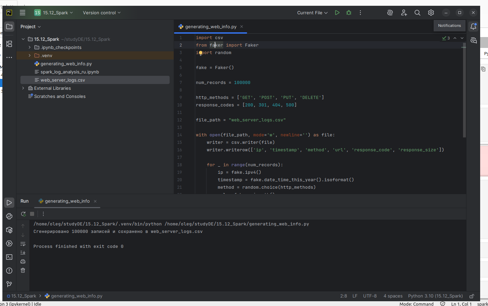
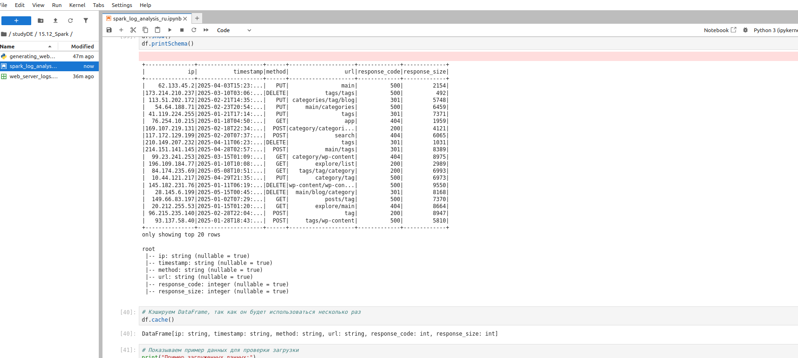
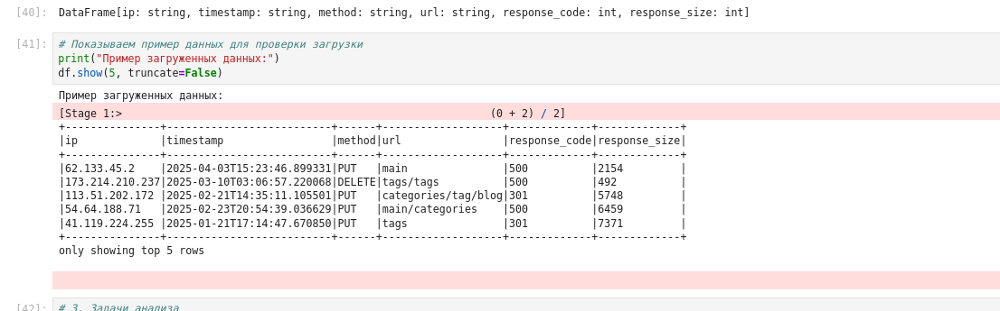
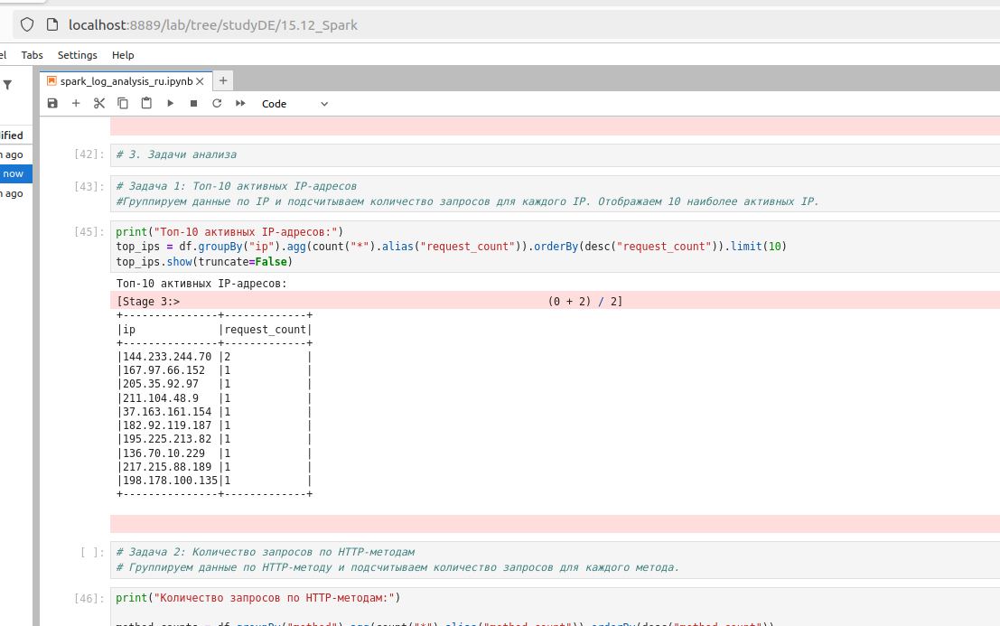
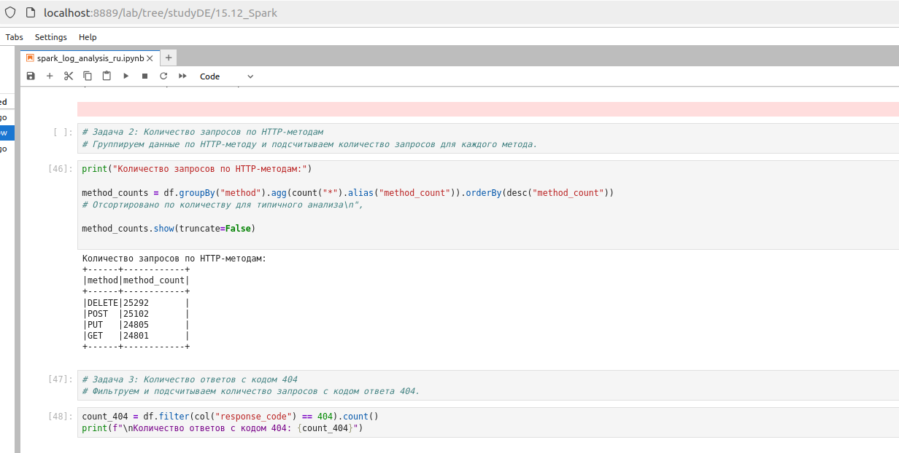
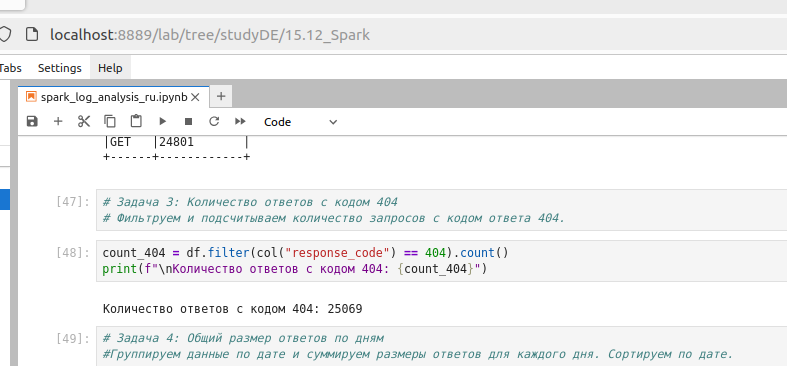
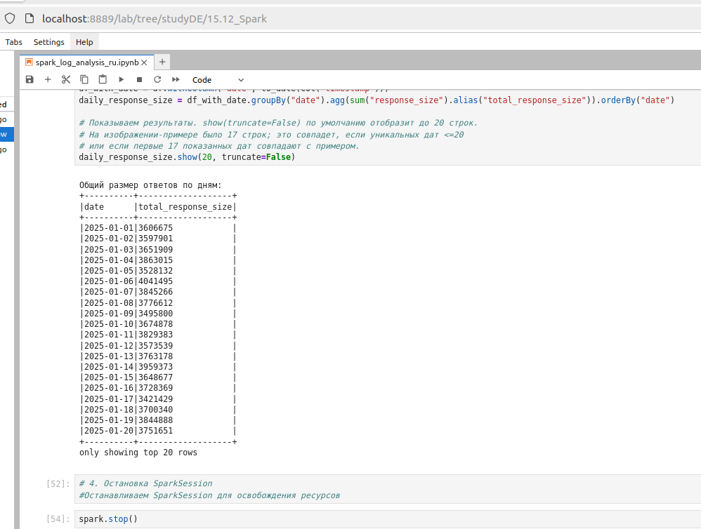

```
# Итоговое задание №6

Генерация информации:



Для наглядности вывел часть данных и схему:
 
 

## Часть 2. Анализ информации

1.  Сгруппируйте данные по IP и посчитайте количество запросов для каждого IP, выводим 10 самых активных IP.
 

2.  Сгруппируйте данные по HTTP-методу и посчитайте количество запросов для каждого метода.
 

3.  Профильтруйте и посчитайте количество запросов с кодом ответа 404.
 

4.  Сгруппируйте данные по дате и просуммируйте размер ответов, сортируйте по дате.
 

В файле "With_generating_code_spark_log_analysis_ru.ipynb" лежит скрипт со сгенерированной информации, как дополнение. 

```